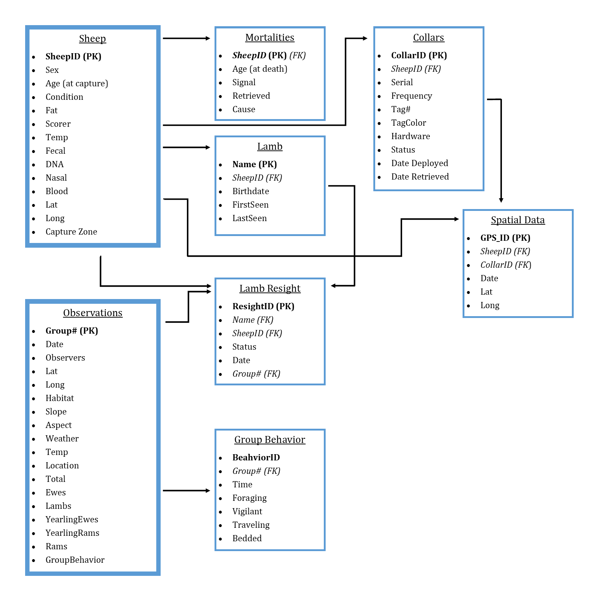

# **Building a Database**

## Organizing Data with Relational Databases

Organizing data is crucial for effective data management and analysis, and a relational database provides a robust framework for this purpose. By structuring data into interconnected tables that reflect real-world relationships between data entities, relational databases enhance both the integrity and consistency of the dataset. This approach encourages critical thinking about data structure while reducing redundancy and improving quality control. Additionally, the centralized storage and design of relational databases streamline data processing and facilitate efficient access, making them especially valuable for collaborative research efforts. I will be designing, building, and populating a relational database to store data collected for my research.

------------------------------------------------------------------------

## Database Design

Building on these principles, the design of my relational database reflects the structure and scope of the data collected for my research. Each table is organized around a specific sampling unit that represents a unique level of data collection, ensuring clarity and consistency. For instance, individual sheep serve as the sampling unit for a table containing characteristics like sex, age, and body condition, while group observations use a group ID as their sampling unit to record variables such as group number, size, habitat type, and location. Each table includes a **primary key**, a unique identifier for every record in the table, such as an individual ID for sheep or a group ID for observations. **Foreign keys**, which are variables shared between tables, link these datasets and maintain relational integrity; for example, an individual ID links observations of collared ewes to their lambs or mortality records. See conceptual diagram of relational database for all data tables below.



------------------------------------------------------------------------

Defining clear sampling units ensures each table is logically structured and avoids redundancy, while primary and foreign keys enable seamless connections between related data. This relational architecture mirrors real-world relationships and facilitates accurate querying and analysis.

------------------------------------------------------------------------

## Creating a Database

To construct the relational database for this project, I used the `RSQLite` and `DBI` packages in `R`, which provide an interface for creating and managing SQLite databases. This approach allows for seamless integration with `R` workflows, enabling efficient storage, querying, and manipulation of data directly within the `R` environment.

### Install and Load Required Packages

Load necessary packages using the `library()` function.

```{r load-package-dbi, warning=FALSE}

library(RSQLite)
library(DBI)
```

Note that if these packages have never been installed on your computer use `install.packages()` instead.

```{r install database packages, eval=FALSE, echo=TRUE}

install.packages("RSQLite")
install.packages("DBI")
```

------------------------------------------------------------------------

### Link Database

The `dbConnect` function is used to establish a connection to a database by providing a file path. If the database file already exists at that path, it connects to it; if not, it creates a new database at the specified location.

```{r link-database, warning=FALSE}
#Link database
jd_sheep_db <- dbConnect(RSQLite::SQLite(), "C:/Users/emily/Documents/Project/Data/raw/Database/jd_sheep.db")
```

------------------------------------------------------------------------

## Populating a Database

### **Sheep Table**

The sheep table has the primary key of sheepID and contains data for each collared sheep including sex, age at capture, body condition, max fat, condition scorer, max body temperature, pregnancy status, whether biological samples (fecal, DNA, nasal swabs, and blood) were collected during capture, latitude and longitude of capture location, and the capture zone from which the sheep came.

First, I need to create an empty table with a primary key specified, as well as foreign keys if they exists. I also imposed constraints for the data to follow to avoid data entry errors and ensure uniform labeling.

```{r sheep-table, eval=FALSE, echo=TRUE, results='hide'}

dbExecute(jd_sheep_db,
          "CREATE TABLE sheep (
  sheep_id varchar(15) NOT NULL PRIMARY KEY,
  sex char(1) CHECK (sex IN ('M', 'F')),
  age varchar(2),
  condition real,
  fat real,
  scorer char(2),
  pregnant varchar(6) CHECK (pregnant IN ('Y', 'N', 'unkwn', '')),
  lat real,
  long real,
  capture_zone varchar(15),
  fecal char(1) CHECK (fecal IN ('Y', 'N')),
  dna char(1) CHECK (dna IN ('Y', 'N')),
  nasal char(1) CHECK (nasal IN ('Y', 'N')),
  blood char(1) CHECK (blood IN ('Y', 'N')),
  temp real,
  accession char(4),
  notes varchar
);")

```

Next step is to populate the tables with existing csv files. First, read in the csv file.

```{r, sheep-csv}
sheep <- read.csv("../../../Project/Data/raw/Database/sheep.csv")
```

As mentioned above, certain constraints will need to be enforced for the table to be populated properly. I double checked these constraints by using `names()` to get the column names or `head()` to look at the first few rows of data.

```{r, names-sheep}

names(sheep)

head(sheep, 3)

```

Everything looks good, now I populate the table. Use `dbExecute()`to do this.

```{r populate-sheep-table, eval=FALSE}

dbWriteTable(jd_sheep_db, "sheep", sheep, append = TRUE)
```

Now, I confirm that the data was loaded properly.

```{r check-sheep-table}
dbGetQuery(jd_sheep_db, "SELECT * FROM sheep LIMIT 3")
```

Repeat these steps for each table in the database.

------------------------------------------------------------------------

### **Observations Table**

The observations table has the primary key of groupID and contains data collected during sheep observations including characteristics of the observation site such as date, number of observers and primary observer, coordinates of group of sheep, habitat type, slope, aspect, weather, temperation, and gernal location. The total number of sheep within the group is recorded as well as the composition of ewes, lambs, yearling ewes, yearling rams, and rams in the group.

```{r observations-table, eval=FALSE, echo=TRUE, results='hide'}

dbExecute(jd_sheep_db,
          "CREATE TABLE observations (
  group_id char(7) NOT NULL PRIMARY KEY,
  date date,
  n_observers integer,
  lead_observer varchar(3),
  lat real,
  long real,
  habitat varchar(10) CHECK (habitat IN ('grass', 'cliff', 'outcrop', 'scree', 'mixed')),
  slope varchar(10) CHECK (slope IN ('top', 'mid', 'bottom')),
  aspect varchar(2) CHECK (aspect IN ('N', 'NW', 'NE', 'S', 'SW', 'SE', 'E', 'W')),
  weather varchar(20) CHECK (weather IN ('sunny', 'cloudy', 'overcast', 'rainy', 'windy_sunny', 'windy_cloudy', 'windy_overcast', 'windy_rainy')),
  temp integer,
  location varchar(25),
  total integer,
  ewes integer,
  lambs integer,
  year_ewes integer,
  year_rams integer,
  rams integer,
  notes varchar
);") 
```

Read in the csv file.

```{r, observations-csv}
observations <- read.csv("../../../Project/Data/raw/Database/observations.csv")
```

Double check csv matches empty table.

```{r, names-observations}

names(observations)

head(observations, 3)

```

Populate the table.

```{r populate-observations-table, eval=FALSE}

dbWriteTable(jd_sheep_db, "observations", observations, append = TRUE)
```

Confirm that the data was loaded properly.

```{r check-observations-table}
dbGetQuery(jd_sheep_db, "SELECT * FROM observations LIMIT 3")
```

------------------------------------------------------------------------

### **Mortalities Table**

This contains information if a sheep has died using sheepID as both the primary key and the foregin key linking it back to the Sheep Table. Data in this table includes the age of the sheep at time of death, when we received an alert of mortality signal from the collar, when we investigated the mortality and retreived the collar, and the hypothesized cause of death.

```{r mortalities-table, eval=FALSE, echo=TRUE, results='hide'}

dbExecute(jd_sheep_db,
          "CREATE TABLE mortalities (
  sheep_id varchar(15) NOT NULL PRIMARY KEY,
  age varchar(2),
  signal date,
  retrieved date,
  cause varchar(9) CHECK (cause IN ('cougar', 'predation', 'unknwn', 'harvest', 'capture')),
  notes varchar,
  FOREIGN KEY (sheep_id) REFERENCES sheep(sheep_id)
);")
```

Read in the csv file.

```{r, mortalities-csv}
mortalities <- read.csv("../../../Project/Data/raw/Database/mortalities.csv")
```

Double check csv matches empty table.

```{r, names-mortalities}

names(mortalities)

head(mortalities, 3)

```

Populate the table.

```{r populate-mortalities-table, eval=FALSE}

dbWriteTable(jd_sheep_db, "mortalities", mortalities, append = TRUE)
```

Confirm that the data was loaded properly.

```{r check-mortalities-table}
dbGetQuery(jd_sheep_db, "SELECT * FROM mortalities LIMIT 3")
```

------------------------------------------------------------------------

### **Lambs Table**

This table uses the name of each lamb as a primary key and includes infomation on the lamb including the birthdate, date first observed, date last observed, and whether the lamb survived or not. The lambs mother (sheepID) serves as the foreign key linking it back to the Sheep Table.

```{r lambs-table, eval=FALSE, echo=TRUE, results='hide'}

dbExecute(jd_sheep_db,
          "CREATE TABLE lambs (
  name varchar(15) NOT NULL PRIMARY KEY,
  sheep_id varchar(15),
  birthdate date,
  first_seen date,
  fate varchar(10) CHECK (fate IN ('weaned', 'deceased', 'unknwn')),
  last_seen date,
  notes varchar,
  FOREIGN KEY (sheep_id) REFERENCES sheep(sheep_id)
);")
```

Read in the csv file.

```{r, lambs-csv}
lambs <- read.csv("../../../Project/Data/raw/Database/lambs.csv")
```

Double check csv matches empty table.

```{r, names-lambs}

names(lambs)

head(lambs, 3)

```

Populate the table.

```{r populate-lambs-table, eval=FALSE}

dbWriteTable(jd_sheep_db, "lambs", lambs, append = TRUE)
```

Confirm that the data was loaded properly.

```{r check-lambs-table}
dbGetQuery(jd_sheep_db, "SELECT * FROM lambs LIMIT 3")
```

------------------------------------------------------------------------

### **Resight Table**

This table contains data on individual resights of collared sheep and lambs, collected during observations. A resightID will serve as the primary key.The sheepID of the collared ewe will be recorded as well as her lamb status (whether she has a lamb at heel) along with the name of that lamb. Date and which group observation this resight was a part of (groupID) will also be recorded. SheepID, name, and groupID will serve as foreign keys linking back up to the Sheep, Lambs, and Observations Tables, respectivley.

```{r resight-table, eval=FALSE, echo=TRUE, results='hide'}

dbExecute(jd_sheep_db,
          "CREATE TABLE resight (
  resight_id varchar(30) NOT NULL PRIMARY KEY,
  name varchar (15),
  sheep_id varchar(15),
  status varchar(7) CHECK (status IN ('nursing', 'follow', 'contact', 'bedded', 'unknown', 'none')),
  date date,
  group_id char(7), 
  FOREIGN KEY (name) REFERENCES lambs(name)
  FOREIGN KEY (sheep_id) REFERENCES sheep(sheep_id),
  FOREIGN KEY (group_id) REFERENCES observations(group_id)
);")
```

Read in the csv file.

```{r, resight-csv}
resight <- read.csv("../../../Project/Data/raw/Database/resight.csv")
```

Double check csv matches empty table.

```{r, names-resight}

names(resight)

head(resight, 3)

```

Populate the table.

```{r populate-resight-table, eval=FALSE}

dbWriteTable(jd_sheep_db, "resight", resight, append = TRUE)
```

Confirm that the data was loaded properly.

```{r check-resight-table}
dbGetQuery(jd_sheep_db, "SELECT * FROM resight LIMIT 3")
```

------------------------------------------------------------------------

### **Group Behavior Table**

Group behavior will be recorded multiple times during observations and will include the proportion of animals in the group who are foraging, vigilant, traveling, or bedded. A timestamp of each behavior snapshot will serve as the primary key, and will link back up with the Observations Table using groupID as the foreign key.

```{r group_behavior-table, eval=FALSE, echo=TRUE, results='hide'}

dbExecute(jd_sheep_db,
          "CREATE TABLE group_behavior (
  timestamp datetime NOT NULL PRIMARY KEY,
  foraging integer,
  vigilant integer,
  traveling integer,
  bedded integer,
  sun_shade varchar(5),
  group_id char(7),
  notes varchar,
  FOREIGN KEY (group_id) REFERENCES observations(group_id)
);")
```

Read in the csv file.

```{r, group_behavior-csv}
group_behavior <- read.csv("../../../Project/Data/raw/Database/group_behavior.csv")
```

Double check csv matches empty table.

```{r, names-group_behavior}

names(group_behavior)

head(group_behavior, 3)

```

Populate the table.

```{r populate-group_behavior-table, eval=FALSE}

dbWriteTable(jd_sheep_db, "group_behavior", group_behavior, append = TRUE)
```

Confirm that the data was loaded properly.

```{r check-group_behavior-table}
dbGetQuery(jd_sheep_db, "SELECT * FROM group_behavior LIMIT 3")
```

------------------------------------------------------------------------

### **Collars Table**

The collars table contains information about the GPS collars including serial numbers, frequencies, visual marker inforation (tag number and color), which side the hardware is on, whether it is deployed, on mortality, or retreived, the date it was deployed and the date it was retrieved. Which sheep (sheepID) the collar is affixed to will serve as a foreign key linking back to the Sheep Table. A collarID will serve as the primary key.

```{r collars-table, eval=FALSE, echo=TRUE, results='hide'}

dbExecute(jd_sheep_db,
          "CREATE TABLE collars (
  collar_id char(8) NOT NULL PRIMARY KEY,
  sheep_id varchar(15),
  serial varchar(5),
  frequency real,
  tag_number integer,
  tag_color varchar(10),
  hardware varchar(5) CHECK (hardware IN ('Right', 'Left')),
  status varchar(9) CHECK (status IN ('deployed', 'data', 'clean')),
  deployed date,
  retrieved date,
  FOREIGN KEY (sheep_id) REFERENCES sheep(sheep_id)
);")
```

Read in the csv file.

```{r, collars-csv}
collars <- read.csv("../../../Project/Data/raw/Database/collars.csv")
```

Double check csv matches empty table.

```{r, names-collars}

names(group_behavior)

head(group_behavior, 3)

```

Populate the table.

```{r populate-collars-table, eval=FALSE}

dbWriteTable(jd_sheep_db, "collars", collars, append = TRUE)
```

Confirm that the data was loaded properly.

```{r check-collars-table}
dbGetQuery(jd_sheep_db, "SELECT * FROM collars LIMIT 3")
```

------------------------------------------------------------------------

### **Spatial Data Table**

The spatial data table contains locations transmitted from GPS collars. A gpsID will serve as the primary key. Which sheep (sheepID) and collar (collarID) the location came from will serve as foreign keys linking back up to the Sheep and Collar Tables, respectively.

```{r spatial_data-table, eval=FALSE, echo=TRUE, results='hide'}

dbExecute(jd_sheep_db,
          "CREATE TABLE spatial_data (
  point_id varchar NOT NULL PRIMARY KEY,
  sheep_id varchar(15),
  collar_id char(8),
  timestamp datetime,
  lat real,
  long real
);")
```

I do not yet have my spatial data and therefore will not populate the table at this time, but use the code below to do so when I'm ready.

```{r, populate-spatial_data-table, eval=FALSE}
#load csv
spatial_data <- read.csv("../../../Project/Data/raw/Database/spatial_data.csv")

#double check csv matches empty table
names(spatial_data)
head(spatial_data, 3)

#populate the table
dbWriteTable(jd_sheep_db, "spatial_data", spatial_data, append = TRUE)

#confirm data was loaded properly 
dbGetQuery(jd_sheep_db, "SELECT * FROM spatial_data LIMIT 3")
```

------------------------------------------------------------------------
