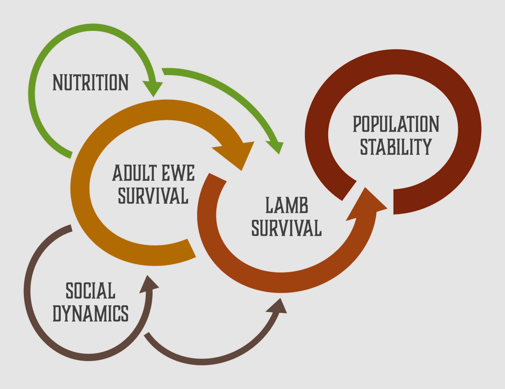
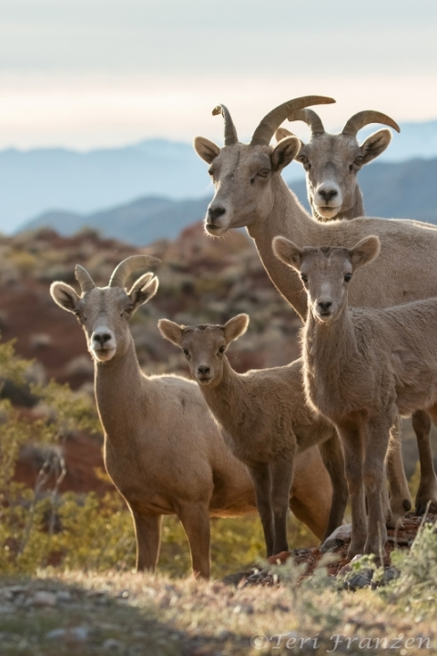

# **Background**

## Purpose of This Book

The purpose of this document is to create a detailed and transparent record of data preparation steps undertaken for my research project on the Lower John Day bighorn sheep population. By documenting the processes of database creation, cleaning, and exploration, this document ensures that all data manipulation and organization steps are clearly recorded, enabling reproducibility and facilitating collaboration. Clean and tidy data are foundational to robust analyses, as they minimize errors and streamline subsequent modeling and interpretation. Recording every stage of data manipulation not only improves transparency but also allows for the verification and replication of findings, which are cornerstones of science integrity. Additionally, by following a reproducible workflow, this document aims to act as a simple guide for preparing ecological data for analysis and provide example code with detailed explanation and commenting.

------------------------------------------------------------------------

## Ecological Background of Study

Demographic variation in large herbivores is shaped by an interplay of intrinsic and extrinsic factors, with adult female and juvenile survival serving as key determinants of population stability. Nutrition is a fundamental driver of these dynamics, as the quality and availability of forage across the landscape directly influence individual fitness and reproductive success. Foraging decisions often involve balancing nutrient acquisition with risks such as predation, competition, and human disturbance, which vary across environmental conditions and life-history stages. Social structures, particularly fission-fusion, further mediate these trade-offs by enabling flexible group sizes and compositions. Larger groups may reduce predation risk and enhance foraging efficiency, while smaller groups may limit competition or reduce disease transmission. Together, these factors interact to govern population performance, highlighting the importance of understanding these mechanisms underlying demographic outcomes.

------------------------------------------------------------------------

Bighorn sheep (*Ovis canadensis*) are a large herbivore species where both nutrition and social dynamics play a large role in shaping population performance. However, bighorn sheep in North America have faced significant population declines due to a mix of factors including over hunting, habitat loss, and disease, particularly pneumonia. In Oregon, bighorn sheep were extirpated by 1915 and in response the Oregon Department of Fish and Wildlife began reintroducing by 1954. These reintroduction efforts have led to the establishment of several bighorn sheep herds throughout the Oregon, with varying levels of success.

------------------------------------------------------------------------

## Study System

The Lower John Day River Canyon in north-central Oregon is home to a thriving population of bighorn sheep with over 1,000 individuals. The diversity of the habitat, with its mosaic of high-quality forage patches and secure escape terrain, provides an ideal setting to investigate how bighorn sheep balance nutritional needs with predation risk. Unlike many bighorn sheep populations, the Lower John Day herd has not been heavily impacted by disease, which allows for a more focused examination of the effects of nutrition and social dynamics on vital rates without the confounding influence of disease.

My research aims to examine how ewes’ use of the foodscape and group dynamics, particularly fission-fusion behavior, influence lamb survival and adult ewe survival. Studying this population will not only provide insights into the ecological mechanisms underpinning bighorn sheep demographics but will also inform management practices aimed at sustaining healthy herds across their range.

To address the objectives of this study, numerous data was collected. This book will show the process of entering and organizing these data using a relational database, cleaning these data to make it tidy, and exploring these data. These steps will ensure data collected for this research project are prepared and ready to be analyzed to answer hypotheses surrounding bighorn sheep survival and habitat selection.

------------------------------------------------------------------------
